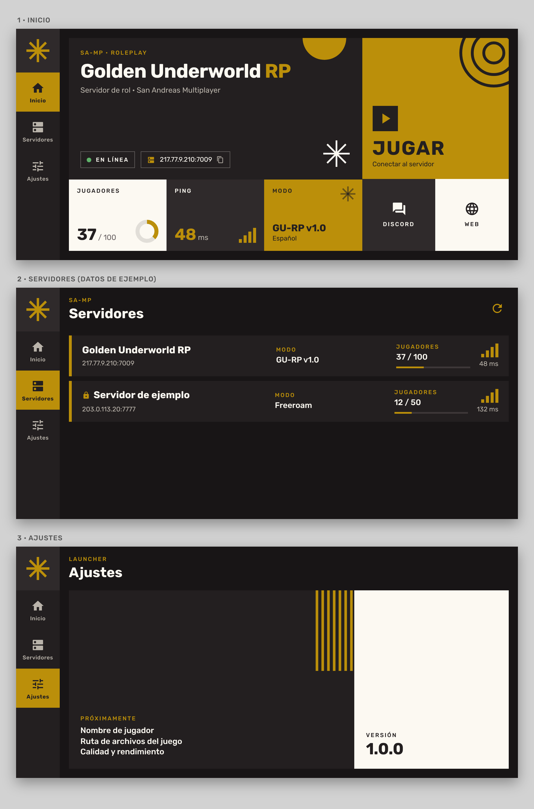

# Golden Underworld RP · Launcher

Launcher móvil (Android) para el servidor de rol **Golden Underworld RP** de SA-MP, hecho con Dart y Flutter.



> La imagen es una maqueta de referencia del diseño (negro · dorado · crema), no una captura de pantalla.

## Compilar

Requiere Flutter 3.27.0 (el mismo que usa el workflow de GitHub Actions).

```
flutter pub get
flutter run          # en un dispositivo/emulador en horizontal
flutter build apk
```

También puedes generar el APK de depuración desde **Actions → Build APK → Run workflow**.

## Configuración rápida

Todo lo editable (nombre, IP, puerto, enlaces de Discord y web) está en
[`lib/config/app_config.dart`](lib/config/app_config.dart).

## Estructura

```
lib/
├── config/        Datos de marca y del servidor
├── bloc/          Estado (BLoC con RxDart): servidores y navegación
├── state/         Eventos y estados de los BLoC
├── entities/      Modelos
├── repository/    Origen de los datos (lista de servidores)
├── services/      Consulta UDP al servidor (samp_query)
└── ui/
    ├── theme/     Colores, tipografía y medidas (único lugar con valores de diseño)
    ├── shell/     Barra lateral + página activa
    ├── screens/   home · servers · settings
    ├── widgets/   Componentes reutilizables (GeoTile, formas, chips…)
    └── utils/     Acciones de UI (copiar, abrir enlaces, avisos)
```

Guía de diseño: [`docs/DESIGN.md`](docs/DESIGN.md).

## Créditos y licencia

Basado en *Artplay: launcher* de Marlon "Eiss" Lorram (licencia BSD). Se conservan
el archivo [LICENSE](LICENSE) y los avisos de copyright de los archivos originales.
